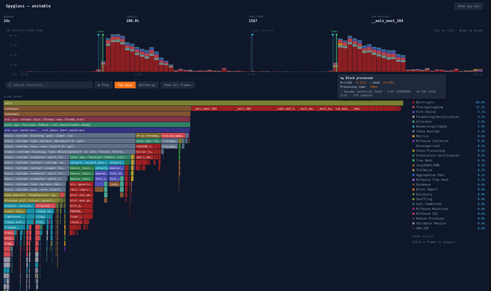

# Spyglass

A Python CLI tool for CPU and memory profiling of [Lighthouse](https://github.com/sigp/lighthouse).

_WARNING: This tool is a work-in-progress. There will be bugs_

## Screenshot



## Features

- **CPU profiling:** via `perf record` with automatic flamegraph generation
- **Memory profiling:** via jemalloc heap dumps
- **Epoch boundary isolation:** capture profiles around specific epoch transitions
- **Category-based analysis:** configurable pattern matching to group samples by subsystem
- **Custom flamegraph timeline:** timeline of flamegraphs across an epoch boundary colour-coded by subsystem
- **Comparison:** side-by-side delta reports between two profiling runs
- **Metrics scraping:** Prometheus metrics captured at epoch boundaries for cache/timing analysis

## Requirements

- Python 3.11+
- [uv](https://docs.astral.sh/uv/) (recommended) or pip
- Linux with `perf` installed
- [inferno](https://github.com/jonhoo/inferno) (`cargo install inferno`)
- `jeprof` (from the `jemalloc` package) (for memory profiling)

## Installation

```bash
# Install uv if you don't have it
# Arch: sudo pacman -S uv
# Other: curl -LsSf https://astral.sh/uv/install.sh | sh

# Clone and install
git clone <repo-url> spyglass
cd spyglass
uv venv
uv pip install -e .

# Activate the virtual environment
source .venv/bin/activate    # bash/zsh
source .venv/bin/activate.fish  # fish

# Now `spyglass` is available directly
spyglass --version
```

## Quick Start

If you've installed with `uv pip install -e .`, you can use `spyglass` directly. Otherwise, use `python3 -m spyglass` instead.

```bash
# Configure (at minimum you will need to add the path to your Lighthouse directory)
cp config.toml my_config.toml
vim my_config.toml

# Full workflow: build + run
spyglass profile --mode cpu -c my_config.toml -n my-experiment

# Or step by step
spyglass build --mode cpu -c my_config.toml
spyglass run --mode cpu -c my_config.toml -n baseline

# Then analyze
spyglass analyze baseline -c my_config.toml --filter all
```

## Commands

### `build`

Builds Lighthouse with profiling instrumentation.

```bash
python3 -m spyglass build --mode cpu      # Frame pointers for perf
python3 -m spyglass build --mode memory   # jemalloc profiling support
```

- CPU mode: passes `RUSTFLAGS="-C force-frame-pointers=yes"`
- Memory mode: uses `--profile release-profiling` with `--features jemalloc-profiling` and sets `JEMALLOC_SYS_WITH_MALLOC_CONF` with `prof:true`

### `run`

Runs Lighthouse under a profiler with a mock execution layer.

```bash
python3 -m spyglass run --mode cpu -n baseline
python3 -m spyglass run --mode cpu -n multi-epoch --epochs 3
```

The tool automatically:
- Starts `lcli mock-el` for the execution layer
- Enables the beacon HTTP API and metrics server
- Polls the beacon API to detect sync completion and epoch boundaries
- Scrapes Prometheus metrics at epoch boundaries (pre/post delta)
- Terminates cleanly on completion or Ctrl+C

### `analyze`

Processes profiling output into flamegraphs and markdown reports.

```bash
python3 -m spyglass analyze my-run --filter epoch-boundary
python3 -m spyglass analyze my-run --filter all  # runs all three filters
```

Produces (per filter, under `views/<filter>/`):
- `profile.collapsed` — collapsed stack format
- `flamegraph.svg` — interactive flamegraph
- `analysis.md` — category breakdown + top functions

### `compare`

Compares two profiling runs.

```bash
spyglass compare baseline optimized --filter epoch-boundary
spyglass compare baseline optimized --filter all  # compares all available views
```

Produces a `comparison.md` with category-level and function-level deltas, plus a differential flamegraph.

### `profile`

Convenience command: `build` + `run` + `analyze` in one step.

```bash
spyglass profile --mode cpu -n my-experiment
```

### `export`

Exports profile data in formats suitable for external tools.

```bash
# Export filtered perf script text (for Firefox Profiler)
spyglass export baseline perf-script --filter epoch-boundary

# Export a filtered flamegraph SVG
spyglass export baseline flamegraph --filter epoch-boundary

# Generate an interactive HTML flame chart (epoch boundary timeline)
spyglass export baseline flamechart
spyglass export baseline flamechart --bin-size 0.25  # finer time resolution
```

The `perf-script` format can be uploaded to [Firefox Profiler](https://profiler.firefox.com) for interactive analysis. The `flamechart` format produces a self-contained HTML file with a category-coloured timeline and per-bin flamegraphs.

### `clean`

Removes spyglass artifacts (PR checkouts and/or profiling results).

```bash
spyglass clean              # Remove PR checkouts only (default)
spyglass clean all --force  # Remove checkouts + profiles
spyglass clean profiles     # Remove only profiling results (prompts for confirmation)
```

### `run --attach`

Attach to an already-running Lighthouse node instead of building and managing the runtime. Spyglass finds the process automatically by scanning `/proc` for a `lighthouse bn` process matching the `network` and `http_port` in your config.

```bash
# Attach to the local lighthouse bn (auto-detected from config)
spyglass run --mode cpu --attach -n my-profile

# Explicit PID if auto-detection can't disambiguate
spyglass run --mode cpu --attach --pid 12345 -n my-profile
```

After profiling completes, the lighthouse process is left running — spyglass only detaches `perf`.

#### Side-by-side profiling (stable vs unstable)

When running two simultaneous lighthouse instances on the same network (e.g. for A/B comparison), use separate configs with different `http_port` values to distinguish them:

```toml
# config-stable.toml
[lighthouse]
http_port = 5052

# config-unstable.toml
[lighthouse]
http_port = 5053
```

```bash
# Each command finds the right process by matching http_port
spyglass run --mode cpu --attach -c config-stable.toml -n stable --epochs 3
spyglass run --mode cpu --attach -c config-unstable.toml -n unstable --epochs 3

# Compare
spyglass analyze stable --filter all
spyglass analyze unstable --filter all
spyglass compare stable unstable --filter all
```

### Profiling a GitHub PR

Fetch and profile a pull request directly from `sigp/lighthouse`:

```bash
# Profile PR #6789 (clones into checkouts/pr-6789/, builds, profiles)
spyglass profile --mode cpu --pr 6789

# Compare against your local branch
spyglass profile --mode cpu -n baseline
spyglass analyze baseline --filter all
spyglass analyze pr-6789 --filter all
spyglass compare baseline pr-6789 --filter all
```

The `--pr` flag works with any command (`build`, `run`, `profile`). It:
- Shallow-clones the Lighthouse repo into `checkouts/pr-<number>/`
- Fetches the PR ref and checks it out
- Uses that checkout for building and profiling
- Defaults the nickname to `pr-<number>`

## Output Structure

```
profiles/
  <nickname-or-branch>/
    cpu/
      perf.data             # Raw perf recording
      profile.collapsed     # Full collapsed stacks (unfiltered)
      epochs.json           # Detected epoch boundaries with timestamps
      run.json              # Run metadata (config, timing, clock offset)
      metrics/
        epoch_<N>_pre.txt
        epoch_<N>_post.txt
        epoch_<N>_delta.json
      views/
        epoch_boundary/     # Filtered to epoch boundary windows
          profile.collapsed
          flamegraph.svg
          analysis.md
        mid_epoch/          # Filtered to mid-epoch periods
          ...
        steady_state/       # Filtered to steady-state periods
          ...
    memory/
      heap.*.heap
      heap_analysis.md
```

## Configuration

See `config.toml` for all options:

```toml
[paths]
lighthouse_dir = "~/path/to/lighthouse_dir"

[lighthouse]
network = "mainnet"
checkpoint_sync_url = "https://mainnet.checkpoint.sigp.io"
extra_flags = ["--subscribe-all-subnets", "--import-all-attestations"]
http_port = 5052
metrics_port = 5054

[profiling]
perf_frequency = 1000
profile = "release"
disable_backfill = true
output_dir = "./profiles"
nickname = ""
start_slot = 16
end_slot = 15
safety_timeout = 7200

[filtering]
epoch_boundary_warmup = 6
epoch_boundary_cooldown = 6

[mock_el]
listen_address = "127.0.0.1"
listen_port = 8551
```

The `network` field is passed to both `lighthouse bn` and `lcli mock-el`. Supported values: `mainnet`, `gnosis`, `holesky`, `sepolia`, etc.

## Categories

The `categories.toml` file defines pattern-based sample classification. Categories are checked in priority order (first match wins). See the file for the default Lighthouse categories.

## Filters

| Filter | Description |
|--------|-------------|
| `all` | Runs all three filters below in sequence |
| `epoch-boundary` | Samples within warmup/cooldown of epoch transitions |
| `mid-epoch` | Samples NOT near epoch boundaries |
| `steady-state` | Samples after sync completes, excluding epoch boundaries |

## License

Apache 2.0 — see [LICENSE](LICENSE).
